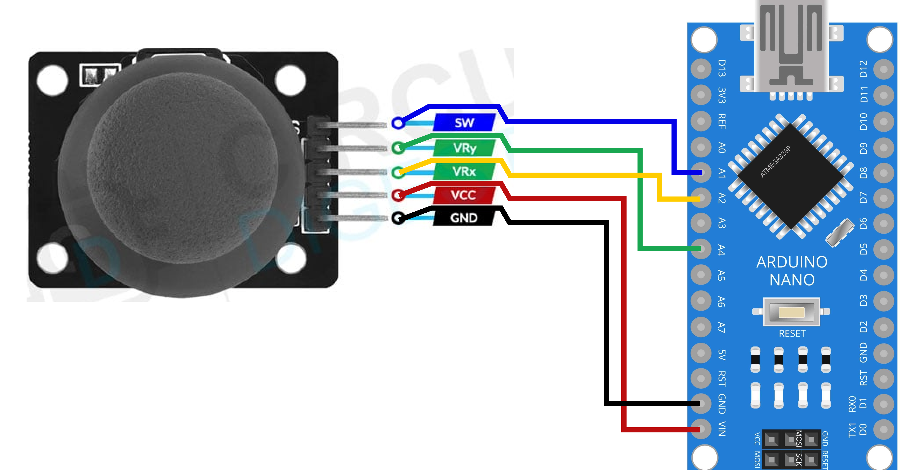

# Joystick Mouse Prototype

## Overview

This project demonstrates a simple joystick-based mouse using an Arduino and Python. The Arduino reads a 2-axis joystick and a button, sending X/Y movement and click state over serial. A Python script interprets the data and moves the system cursor using ydotool.

The goal is to create a keyboard-adjacent pointing device as an alternative to a traditional mouse.

## Hardware Requirements

- Arduino Nano (or compatible board)
- 2-axis analog joystick
- Push button (for primary click)
- USB cable for serial connection

## Connections
- Joystick X → A2
- Joystick Y → A4
- Button → A1 (with INPUT_PULLUP)



## Software Requirements
- Python 3
- ezButton library (Arduino)
- ydotool (Linux)

### What it does
- Reads joystick axes and button state
- Maps analog joystick values to a range of -MOUSE_SENSITIVITY to MOUSE_SENSITIVITY
- Applies a small deadzone to avoid drift
- Sends data over serial in the format:
- X_value:Y_value:button_state

#### Python Script

- Opens serial port to Arduino (/dev/ttyUSB0)
- Reads and parses serial data
- Moves cursor with ydotool according to X/Y values
- Triggers mouse click on button press

#### Behavior
- Joystick movement → cursor movement
- Button press → left mouse click
- Supports continuous movement with adjustable delay (time.sleep(0.02))

## Usage

0) Install ydotool and ensure permissions allow cursor control.
  
1) Connect Arduino to PC and upload the sketch. Might have to unlock port with
```
chmod 777 /dev/ACM*  
chmod 777 /dev/tty*
```
2) Set up the python environment. Ex: `pip install pyserial`

3) Set the port in the python script and run it with:

`python3 joystick_mouse.py`

Move the joystick to control the cursor; press the button to click.

## Notes

Sensitivity and deadzone can be adjusted in the Arduino sketch (MOUSE_SENSITIVITY and threshold).

The script currently uses Linux-specific ydotool; adaptation is needed for other OSes.
